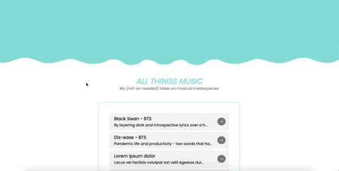

# blog [front-end]  
This project was bootstrapped with [Create React App](https://github.com/facebook/create-react-app).  
 

 
## built with
HTML5, CSS3, and React.js.
## next steps: 
fix the padding on modals, and connect a back-end to deal with posts instead of hardcoding it. 
